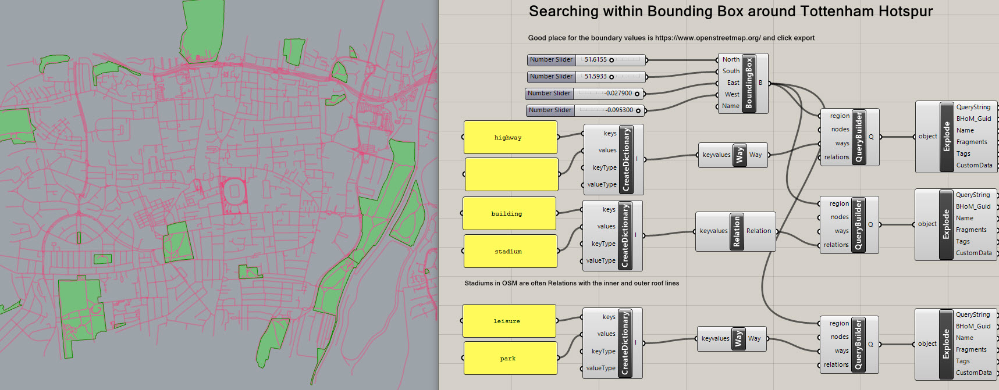
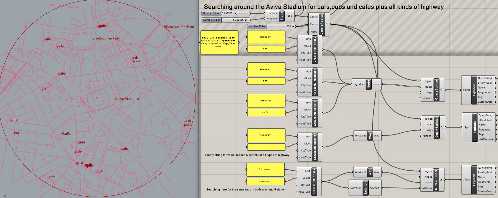
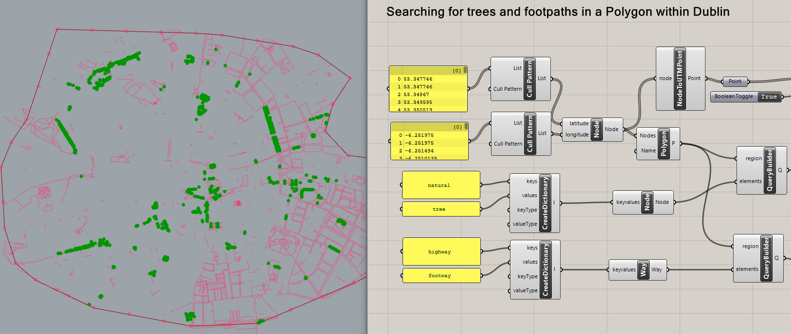
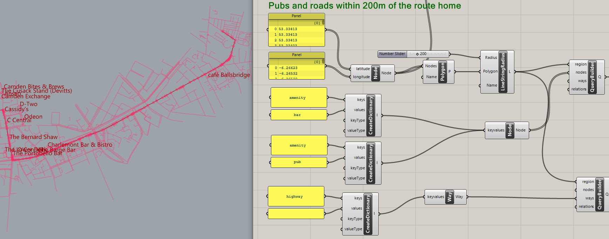
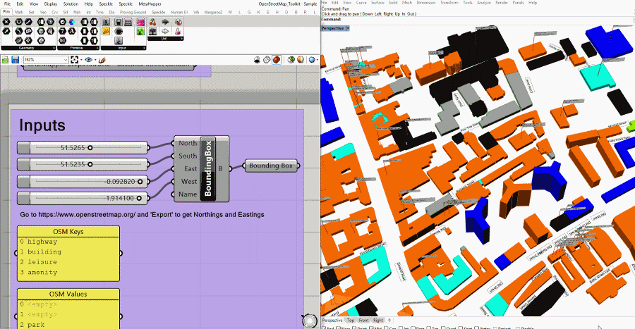
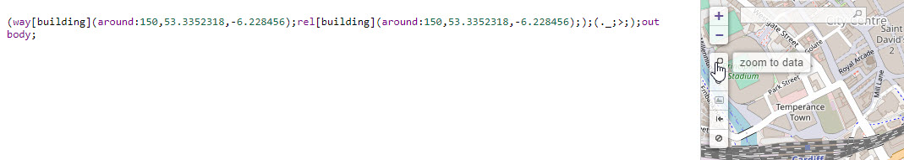
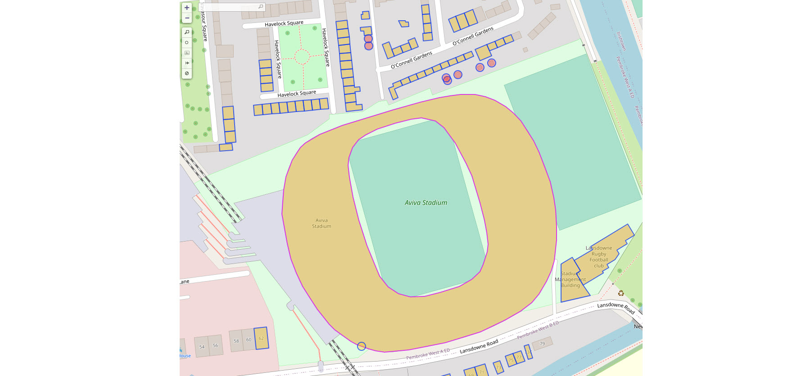

# OpenStreetMap_Toolkit
## Getting started
### See the example files in the examples folder of this toolkit:
- Search in a bounding box

- Search by centre radius

- Search in a polygon

- Search along a line string

### Download a building massing example
- [Building massing](https://burohappold.sharepoint.com/:f:/r/sites/Direction/designtechnology/Script%20Library/00348_OpenStreetMap%20Scripts?csf=1&web=1&e=SLhE1T)

## [Test OpenStreetMap queries online](https://overpass-turbo.eu/)
  - Remove `https://www.overpass-api.de/api/interpreter?data=[out:json];` from the `QueryBuilder.QueryString`
  - Copy the remaining part. For example:
`(way[building](around:150,53.3352318,-6.228456);rel[building](around:150,53.3352318,-6.228456););(._;>;);out body;`
  - Paste into the text box in https://overpass-turbo.eu/.

  - Click run 
  - To view the result on a map, click the magnifying glass to zoom to the data returned on the map

## Resources + background
- https://www.openstreetmap.org/
- [Features mapped in OpenStreetMap](https://wiki.openstreetmap.org/wiki/Map_Features)
- [OpenStreetMap Elements used by this toolkit](https://wiki.openstreetmap.org/wiki/Elements)
- [Geographic_coordinate_system](https://en.wikipedia.org/wiki/Geographic_coordinate_system)
